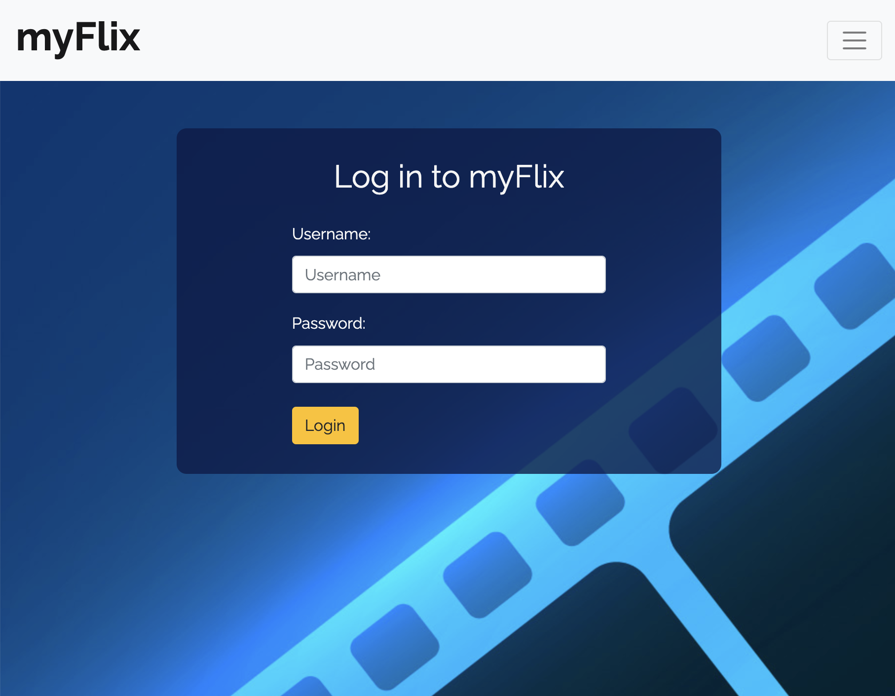
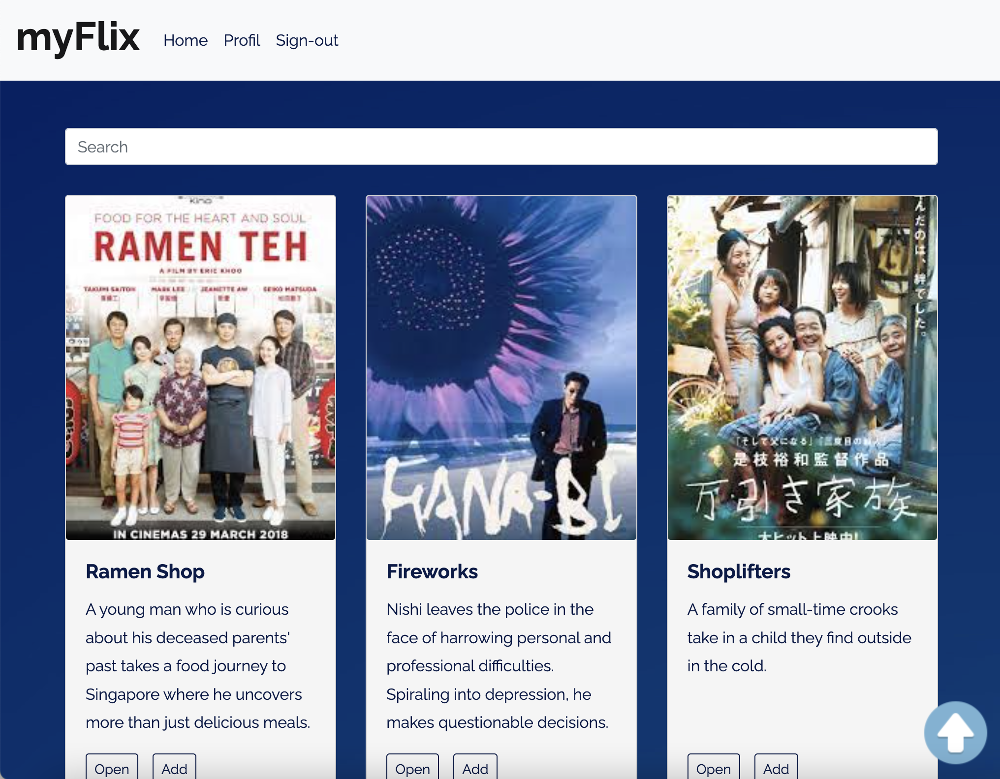

# myFlix-client

## Project description

This is the client-side interface for a movie app based on server-side REST API and database ([movie_api](https://github.com/lkarow/movie_api)). The interface is built with React and Bootstrap. Users are able to sign up and login, update their personal information, and create a list of their favorite movies.

### Login View



### Main View



## Built With

- React
- React-Bootstrap
- Redux
- JavaScript
- Parcel
- SCSS
- HTML

## Dependencies

- Axios
- proptypes
- React
- React-Bootstrap
- React-DOM
- React-Router-DOM
- Redux

## Get Started

1. Clone the project
2. Install all dependencies mentioned in package.json
3. cd to the project directory
4. Run it by:

```bash
$npm run dev
```

Note: Please make sure you install parcel v2!

## Run the Project

You can use the command:

```bash
parcel src/index.html
```
